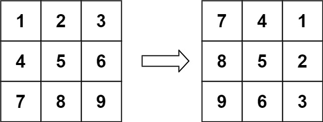
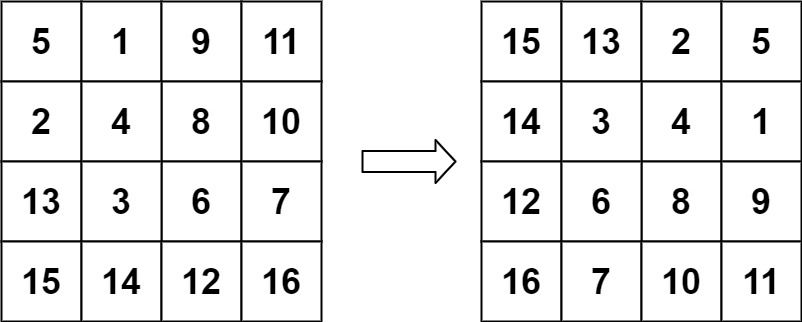

# 48. Rotate Image

You are given an `n x n` 2D `matrix` representing an image, rotate the image by **90** degrees (clockwise).

You have to rotate the image [in-place](https://en.wikipedia.org/wiki/In-place_algorithm), which means you have to modify the input 2D matrix directly. **DO NOT** allocate another 2D matrix and do the rotation.

```pycon
>>> from problems.leetcode.medium.rotate_image import rotate

```

**Example 1:**

> Input: `matrix = [[1,2,3],[4,5,6],[7,8,9]]`

> Output: `[[7,4,1],[8,5,2],[9,6,3]]`

```pycon
>>> matrix = [[1,2,3],[4,5,6],[7,8,9]]

>>> rotate(matrix)

>>> matrix
[[7, 4, 1], [8, 5, 2], [9, 6, 3]]

```



**Example 2:**

> Input: `matrix = [[5,1,9,11],[2,4,8,10],[13,3,6,7],[15,14,12,16]]`

> Output: `[[15,13,2,5],[14,3,4,1],[12,6,8,9],[16,7,10,11]]`

```pycon
>>> matrix = [[5,1,9,11],[2,4,8,10],[13,3,6,7],[15,14,12,16]]

>>> rotate(matrix)

>>> matrix
[[15, 13, 2, 5], [14, 3, 4, 1], [12, 6, 8, 9], [16, 7, 10, 11]]

```



**Constraints:**

- `n == matrix.length == matrix[i].length`
- `1 <= n <= 20`
- `-1000 <= matrix[i][j] <= 1000`

## References

- [48. Rotate Image](https://leetcode.com/problems/rotate-image/)
